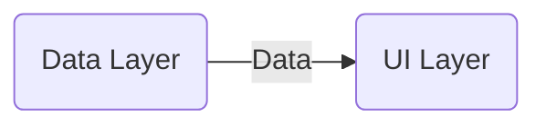
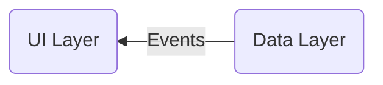

# Architecture
---
## Example Feature: Article collection with bookmark option

- Data Layer: *Obtains & exposes* app data, Performs business *logic*
- UI Layer: *Displays* app data on screen, *Reacts* to changes in app data (*Reactive UI*)
	- Collects data, Does <u>not</u> request/pull data
---

- Data Layer: *Updates* data, *Emits changes* back to UI, "Single source of truth"
---
- *Unidirectional data flow*: Data flows in one direction
---
- *Data Layer*: Stores bookmarks
- *UI Layer*: Displays Bookmarks & news articles
- *User events*: Add/remove bookmark
---
### Data Layer
- *Repository*: Exposes *data*, Centralizes *changes* in data
- *Data source*: *Obtains* data from single source
---
#### Implemented
- `LocalData*Source*` class obtains bookmarks from DataStore, Adds/removes bookmarks from DataStore

# Modularization
---
# Testing
---
# UI Design
---